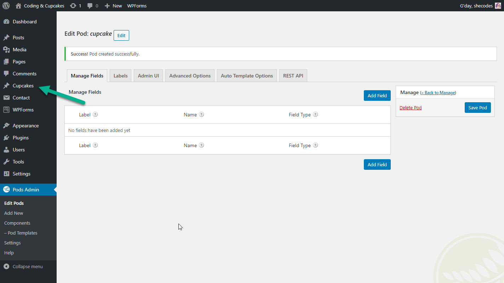
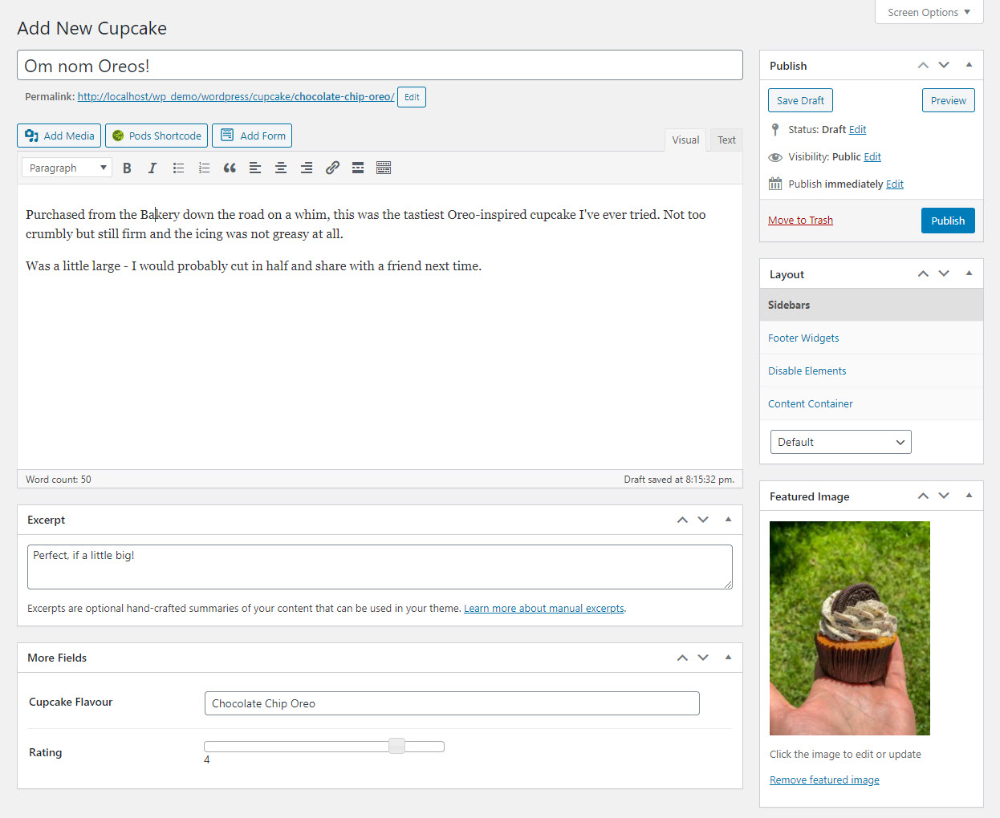
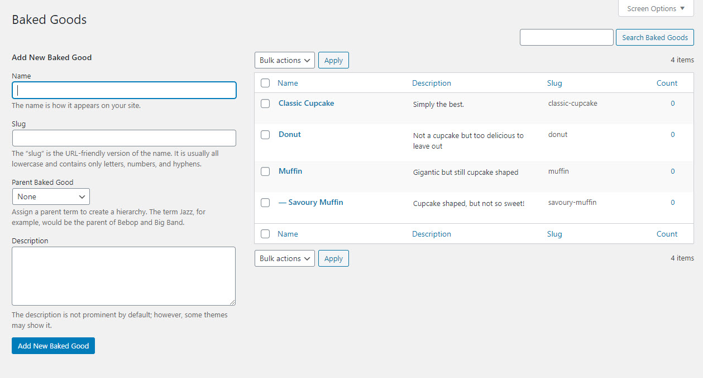

+++
title = "Custom Post Types"
weight = 2
chapter = true
+++

# Extending WordPress with ANYTHING

As we mentioned earlier in this tutorial, WordPress is basically a big database full of content saved as various post types (such as posts or pages) and grouped using taxonomies (such as categories and tags).

This concept can be a bit confusing, so to help you understand it better we're going to create our own custom post type (often referred to as CPT) and set of custom fields to go with it, then categorise it using our own custom groupings.

# Introducing Pods

There are many ways of creating CPTs, whether it be using code, a plugin that creates a specific post type for you, or by using a plugin designed to allow you to create your own of any shape or size. The third option is what we are using today!

In your dashboard, navigate to the Pods Admin menu item on the left sidebar. The first screen you see will ask you what you would like to do - Create New or Extend Existing.

We are going to create a new post type that we are going to display on the page we called 'Directory' right at the start of our WordPress Journey. The directory can be of anything you like, but here are some suggestions:

- A directory of books you've read
- LinkedIn style directory for fictional characters
- A directory of doggos (e.g. for a shelter, or just because)
- A directory of locations you've visited (or want to visit)
- A directory of services offered by a business
- A directory of things you've made/drawn/produced/created *(if you want to sell products online we recommend using WooCommerce for this!)*

If you can't decide, you can follow along with the example we're using - a directory of cupcakes we've tasted in our mission to find the best one ever.

## Creating your first Post Type

In the Pods Admin screen, choose the 'Create New' option.

Give your new post type some labels - we're using 'Cupcake' and 'Cupcakes' respectively.

On the next screen you will see a message that your Pod has been created successfully. You will also see that your new post type will show on the menu on the left sidebar:

Before we add some cupcakes (or doggos, or fictional characters) let's add some additional fields to our post type so that we can store key information.

First we'll make sure that the default fields are set correctly. Choose the 'Advanced Options' tab at the top of the page. Scroll down to the **Supports** section near the bottom of the page and make sure the following are ticked:
- Title
- Editor
- Featured Image
- Excerpt

Save Pod, then in the 'Manage Fields' tab, click the **Add Field** button. 

Let's add fields for some other pieces of information that we might want to collect about the thing in our directory! We're going to add a field for flavour, and a rating out of five. Depending on what you chose for your post type you might want to add a gallery, colour, difficulty... the sky is the limit!

Now it's time to create a cupcake (or doggo, or creation, or book...) by clicking on your new post type in the side menu and then choosing 'Add New.'

Now that I've actually created by cupcake, I quickly realised I forgot to add some fields, such as where I got it from! I can go back into the Pods Admin and edit my cupcake post type to add more fields if I want to.

I've also decided that I want to be able to add more than just cupcakes, because donuts and muffins are pretty great too! I want to be able to easily sort by type of baked good though, so this is a perfect opportunity to create our first custom taxonomy.

{}
Remember - taxonomies (like categories and posts) are used for grouping and displaying content.
{}

Let's head back to Pods and hit Add New again at the top of the Pods Admin screen. Choose Create New, but this time change Custom Post Type to Custom Taxonomy. You can call your taxonomy whatever you like!

We're going to create one for the type of baked good that it falls into. Here are some suggestions for taxonomies based on different post types:

Genre - great for books, movies and music
Breed - for animals
Continent - for places you've visited
Team/Department - for people in a business

The next step is to decide whether we want our taxonomy to be hierarchical or non-hierarchical. For baked goods we'll use hierarchical, because we might want to use sub-categories and because a tick box interface will suit this better given our small number of choices.

You can change whether or not your taxonomy is hierarchical by navigating to the Advanced Options tab, and ticking or unticking the box. On this screen you will also want to associate the new taxonomy with your new post type - simply tick the corresponding box at the bottom (for us that's cupcakes) and hit Save Pod.

You will now see a new option under your custom post type for your new taxonomy - the next step is to add some terms. Terms are the choices that we want to select from. It is common to add hierarchical terms (e.g. categories) all at once, but non-hierarchical terms (e.g. tags) are often added as needed.

Now that you know the basics, experiment with what you can create! 
